# 第三周rust for linux 作业记录
## 课程作业
### 作业1：编译Linux内核
1. 配置编译BusyBox
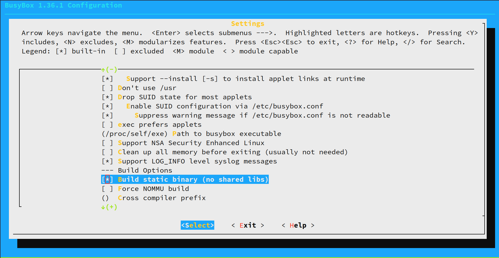
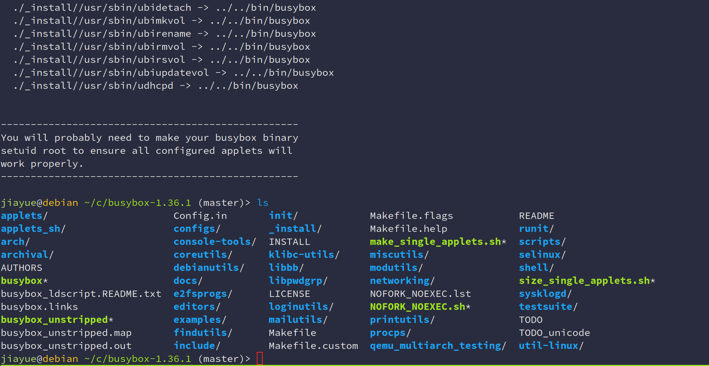
2. 编译Linux内核
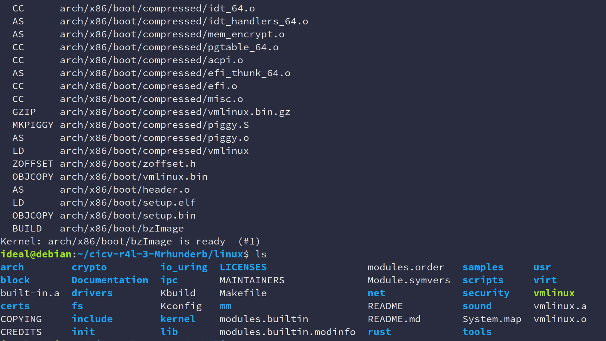

### 作业2：对Linux内核进行一些配置
1. 禁用e1000网卡驱动
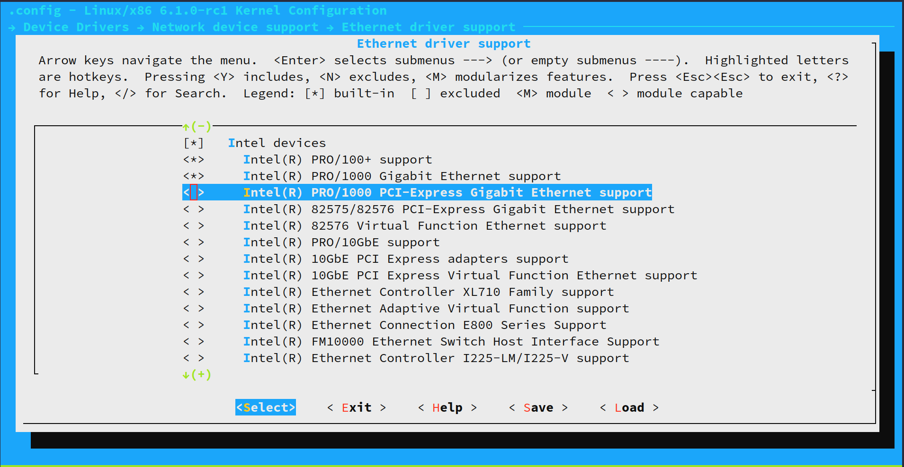
2. 编译src_e1000
3. 使用build_image.sh脚本启动
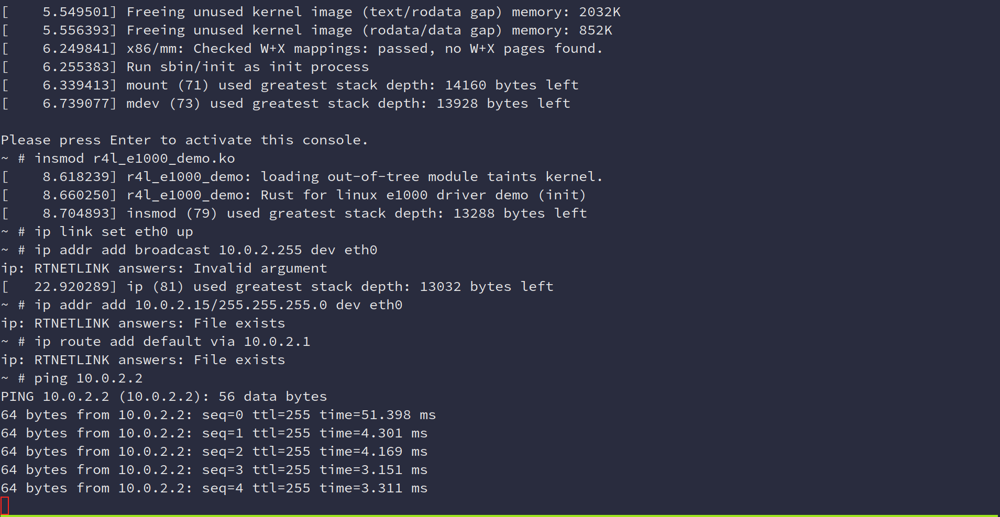

#### Question
- 编译成内核模块，是在哪个文件中以哪条语句定义的？

    在Makefile中，指定 `M=$$PWD`

- 该模块位于独立的文件夹内，却能编译成Linux内核模块，这叫做out-of-tree module，请分析它是如何与内核代码产生联系的？

    模块在编译过程中会使用内核头文件，以确保模块代码与内核接口匹配。模块中使用的内核函数和数据结构由内核导出的符号表解析。

### 作业3：使用rust编写一个简单的内核模块并运行
1. 编写rust_helloworld.rs
2. 配置添加该模块
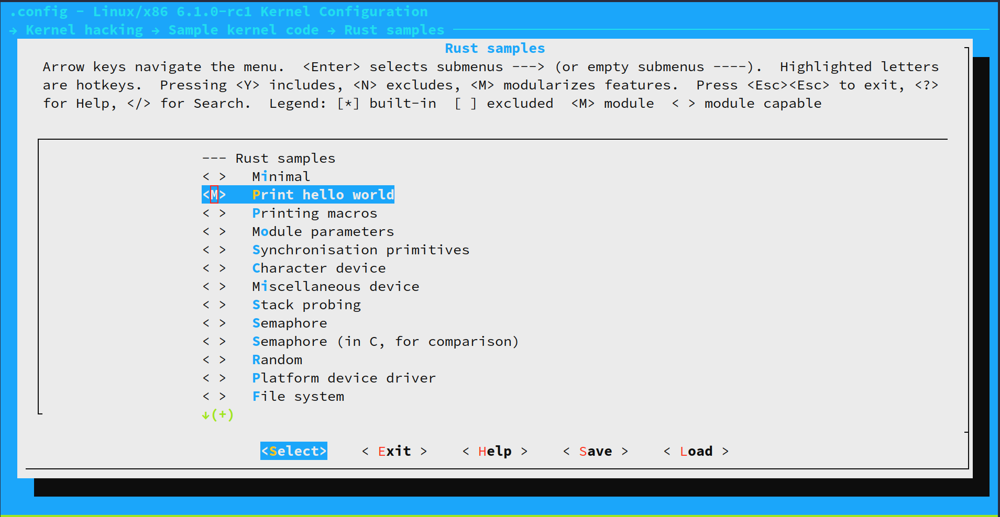
3. 安装运行
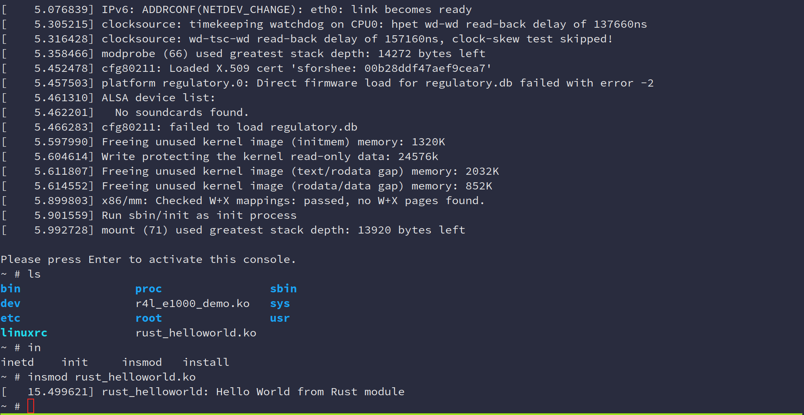

### 作业4：为e1000网卡驱动添加remove代码
### 作业5：注册字符设备
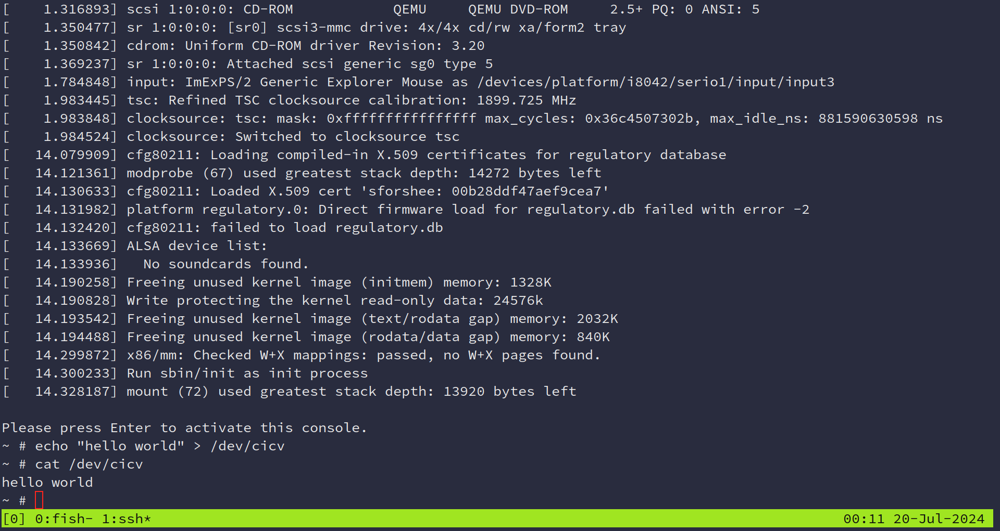

#### Question
- 作业5中的字符设备/dev/cicv是怎么创建的？它的设备号是多少？它是如何与我们写的字符设备驱动关联上的？
1. 在build_image.sh脚本中通过`mknod /dev/cicv c 248 0`创建
2. 设备号为248 
3. 在 `init` 函数中，使用 `chrdev::Registration::new_pinned(name, 0, module)` 方法，将字符设备的name传入，从而关联。

## 项目测验
1. 创建initramfs镜像
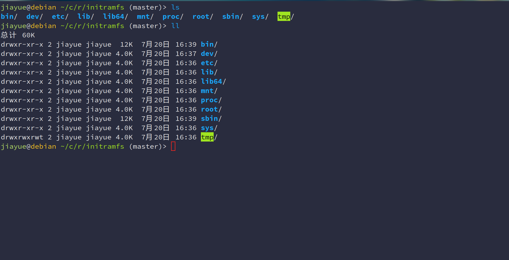
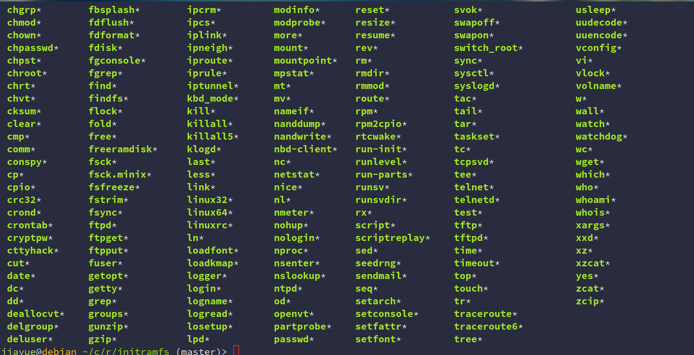

2. 编写init脚本
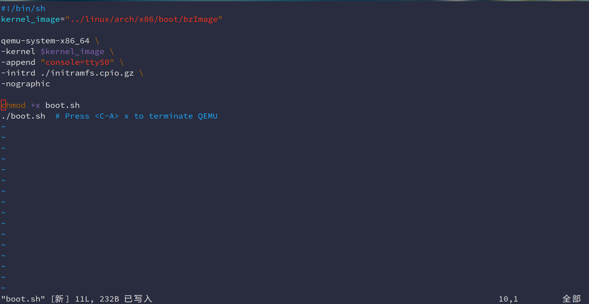
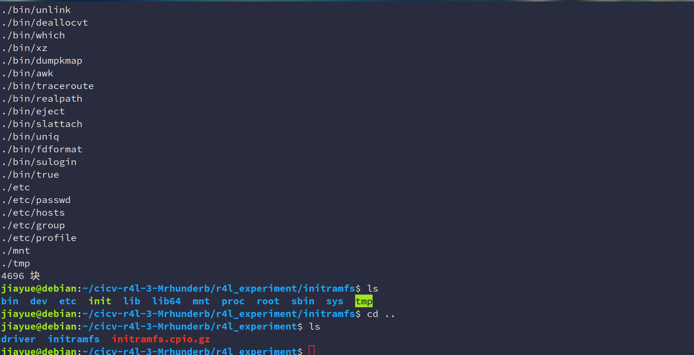
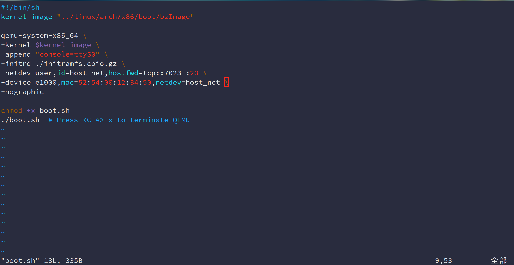
3. 启动NFS以及telnet服务

4. 用rust重构002_completion
