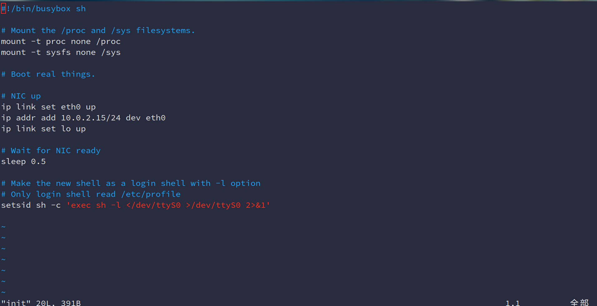
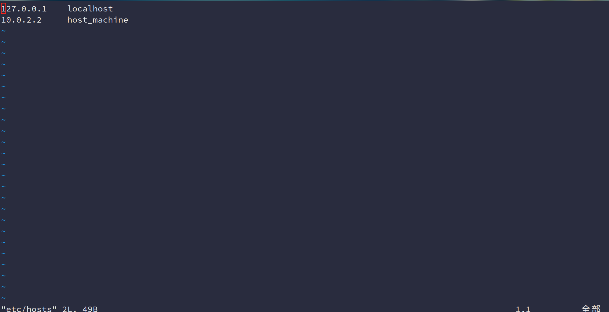
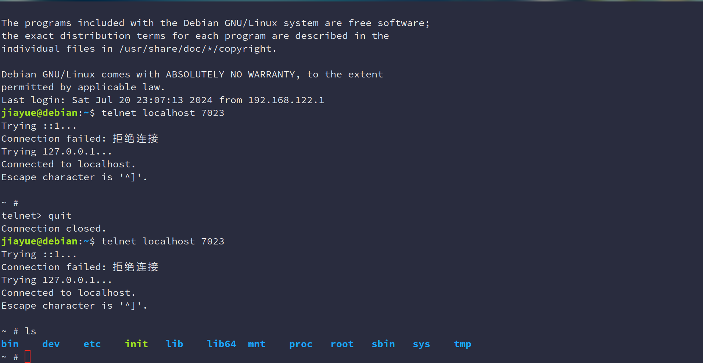

# 第三周rust for linux 作业记录
## 课程作业
### 作业1：编译Linux内核
1. 配置编译BusyBox


2. 编译Linux内核


### 作业2：对Linux内核进行一些配置
1. 禁用e1000网卡驱动

2. 编译src_e1000
3. 使用build_image.sh脚本启动


#### Question
- 编译成内核模块，是在哪个文件中以哪条语句定义的？

    在Makefile中，指定 `M=$$PWD`

- 该模块位于独立的文件夹内，却能编译成Linux内核模块，这叫做out-of-tree module，请分析它是如何与内核代码产生联系的？

    模块在编译过程中会使用内核头文件，以确保模块代码与内核接口匹配。模块中使用的内核函数和数据结构由内核导出的符号表解析。

### 作业3：使用rust编写一个简单的内核模块并运行
1. 编写rust_helloworld.rs
2. 配置添加该模块

3. 安装运行


### 作业4：为e1000网卡驱动添加remove代码
1. 修改net.rs
```rust
impl Napi {
    pub  fn disable(&self) {
        // SAFETY: The existence of a shared reference means `self.0` is valid.
        unsafe {
            bindings::napi_disable(self.0.get());
        }
    }
}
```
2. 修改pci.rs
```rust
impl Device {
    /// disables bus-mastering for device
    pub fn clear_master(&self) {
        // SAFETY: By the type invariants, we know that `self.ptr` is non-null and valid.
        unsafe { bindings::pci_clear_master(self.ptr) };
    }
}
```
3. 完善stop函数
```rust
    fn stop(dev: &net::Device, data: &NetDevicePrvData) -> Result {
        pr_info!("Rust for linux e1000 driver demo (net device stop)\n");

        NetDevice::e1000_recycle_tx_queue(&dev, &data);

        let irq_ptr = data._irq_handler.load(Ordering::Relaxed);
        drop(unsafe{Box::from_raw(irq_ptr)});

        dev.netif_carrier_off();
        dev.netif_stop_queue();

        Ok(())
    }
```
4. 完善remove函数
```rust
impl pci::Driver for E1000Drv {
    fn remove(dev: &mut pci::Device, data: &Self::Data) {
        pr_info!("Rust for linux e1000 driver demo (remove)\n");
        dev.clear_master();
        dev.release_selected_regions(data.bars);
        dev.disable_device();
    }
}
```
5. 运行截图
按照作业2的方法进行配置并ping通后，卸载，再安装

可以ping通


### 作业5：注册字符设备
实现文件读写方法
```rust
impl file::Operations for RustFile {
    fn write(this: &Self,_file: &file::File,reader: &mut impl kernel::io_buffer::IoBufferReader,_offset:u64,) -> Result<usize> {
        let mut buf = this.inner.lock();
        let len = core::cmp::min(reader.len(), GLOBALMEM_SIZE);
        reader.read_slice(&mut buf[0..][..len])?;
        Ok(len)
    }

    fn read(this: &Self,_file: &file::File,writer: &mut impl kernel::io_buffer::IoBufferWriter, offset:u64,) -> Result<usize> {
        let buf = this.inner.lock();
        let mut len = core::cmp::min(writer.len(), GLOBALMEM_SIZE);
        if len <= offset as usize {
            len = 0;
        }
        writer.write_slice(&buf[0..][..len])?;
        Ok(len)
    }
}
```

效果展示


#### Question
- 作业5中的字符设备/dev/cicv是怎么创建的？它的设备号是多少？它是如何与我们写的字符设备驱动关联上的？
1. 在build_image.sh脚本中通过`mknod /dev/cicv c 248 0`创建
2. 设备号为248 
3. 通过设备号关联

## 项目测验
1. 创建initramfs镜像




2. 编写init脚本


3. 启动NFS以及telnet服务


内部可以访问
4. 用rust重构002_completion

在kernel中包装Completion类
```rust
// linux/rust/kernel/sync/completion.rs

use crate::{bindings,  Opaque};
use core::marker::PhantomPinned;


/// A wrapper around a kernel completion object.
pub struct Completion {
    completion: Opaque<bindings::completion>,
}

impl Completion {
    /// The caller must call `completion_init!` before using the conditional variable.
    pub const unsafe fn new() -> Self {
        Self {
            completion: Opaque::uninit(),
        }
    }

    /// Initialise the completion.
    pub fn init(&self) {
        unsafe {
            bindings::init_completion(self.completion())
        };
    }

    /// Wait for the completion to complete.
    pub fn wait_for_completion(&self) {
        unsafe { bindings::wait_for_completion(self.completion.get()) }
    }

    /// Complete the completion.
    pub fn complete(&self) {
        unsafe { bindings::complete(self.completion.get()) }
    }

    /// Get the completion pointer.
    pub fn completion(&self) -> *mut bindings::completion {
        self.completion.get()
    }
}

```
rust重构
```rust
module! {
    type: CompletionChrDev,
    name: "rust_completion",
    author: "Tester",
    description: "Rust completion sample",
    license: "GPL",
}

static COMPLETION: Completion = unsafe { Completion::new() };

struct CompletionFile {
    completed: &'static Completion,
}

#[vtable]
impl file::Operations for CompletionFile {
    type Data = Box<Self>;

    fn open(_shared: &(), _file: &file::File) -> Result<Box<Self>> {
        pr_info!("open() is invoked\n");
        Ok(
            Box::try_new(CompletionFile {
                completed: &COMPLETION,
            })?
        )
    }


    fn read(this: &Self, _file: &file::File, _writer: &mut impl IoBufferWriter, _offset: u64) -> Result<usize> {
        pr_info!("read() is invoked\n");

        let task = Task::current();

        pr_info!("process {} is going to sleep\n",task.pid());
        this.completed.wait_for_completion();
        pr_info!("awoken {}\n", task.pid());
        Ok(0)
    }

    fn write(this: &Self, _file: &file::File, reader: &mut impl IoBufferReader, _offset: u64) -> Result<usize> {
        pr_info!("write() is invoked\n");

        let task = Task::current();
        pr_info!("process {} awakening the readers...\n", task.pid());
        pr_info!("data.len() = {}\n", reader.len());
        this.completed.complete();
        
        Ok(reader.len())
    }

    fn release(_data: Self::Data, _file: &file::File) {
        pr_info!("release() is invoked\n");
    }
}

struct CompletionChrDev {
    _dev: Pin<Box<chrdev::Registration<1>>>,
}

impl kernel::Module for CompletionChrDev {
    fn init(name: &'static CStr, module: &'static ThisModule) -> Result<Self> {
        pr_info!("completion_example is loaded\n");

        COMPLETION.init();
        let mut chrdev_reg = chrdev::Registration::new_pinned(name, 0, module)?;

        // Register the same kind of device twice, we're just demonstrating
        // that you can use multiple minors. There are two minors in this case
        // because its type is `chrdev::Registration<2>`
        chrdev_reg.as_mut().register::<CompletionFile>()?;

        Ok(CompletionChrDev { _dev: chrdev_reg })
    }
}

impl Drop for CompletionChrDev {
    fn drop(&mut self) {
        pr_info!("completion_example is unloaded\n");
    }
}
```

5. 效果展示
